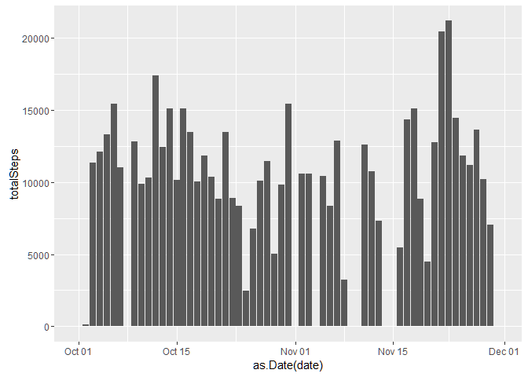
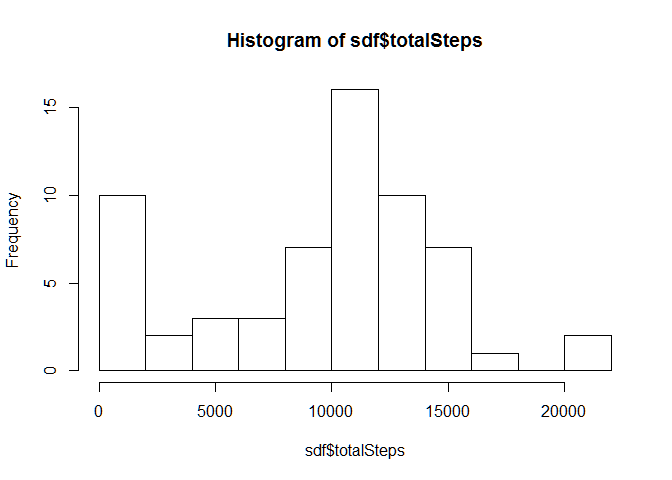
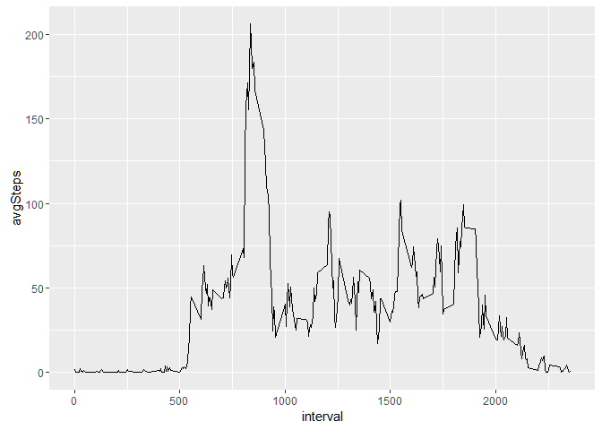
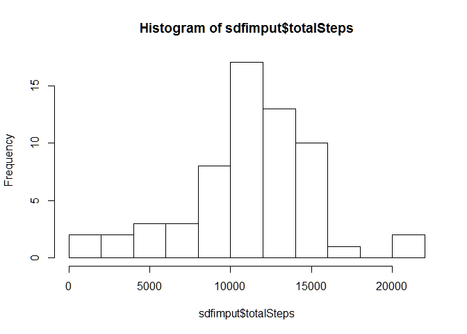
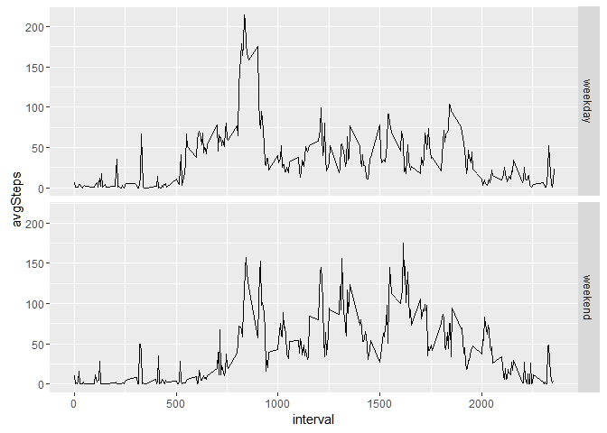
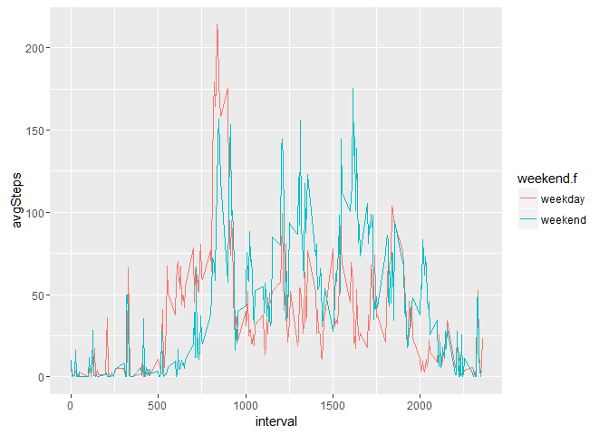

# PA1_template
Marty Quinn  
December 30, 2016  


## PA1_template R Markdown File
Load and preprocess the data

This following code...

    Loads the activity data (i.e. read.csv())
    Process/transform the data (if necessary) into a format suitable for our analysis


```r
#install.packages('ggplot2')
library(ggplot2)
```

```
## Warning: package 'ggplot2' was built under R version 3.1.3
```

```r
library(plyr)
download.file("https://d396qusza40orc.cloudfront.net/repdata%2Fdata%2Factivity.zip", "F:\\productions\\coursera\\datascience\\reproducible\\assign1\\repdata_data_activity.zip")
```

```
## Warning in download.file("https://d396qusza40orc.cloudfront.net/repdata
## %2Fdata%2Factivity.zip", : downloaded length 53559 != reported length 53559
```

```r
unzip("F:\\productions\\coursera\\datascience\\reproducible\\assign1\\repdata_data_activity.zip", overwrite = TRUE)
df <- read.csv("activity.csv")
```

Calculate the total number of steps taken per day and show a plot of these totals per day.

```r
sdf <- ddply(df, c("date"), summarise, totalSteps = sum(steps,na.rm="TRUE"))
ggplot(sdf, aes(x = as.Date(date), y = totalSteps)) + geom_bar(stat = "identity")
```

<!-- -->

Make a histogram of the total number of steps taken each day. 


```r
# Histogram of the total number of steps taken each day
hist(sdf$totalSteps, breaks=10)
```

<!-- -->
The mean number of steps taken per day is 


```r
meanSteps=mean(sdf$totalSteps,na.rm="TRUE")
meanSteps
```

```
## [1] 9354.23
```
The median  number of steps taken per day is 

```r
medianSteps=median(sdf$totalSteps, na.rm="TRUE")
medianSteps
```

```
## [1] 10395
```


The average daily activity pattern is shown here in a time series plot (i.e. type = "l") of the 5-minute interval (x-axis) and the average number of steps taken, averaged across all days (y-axis).
   
    

```r
sdfinterval <- ddply(df, c("interval"), summarise, avgSteps = mean(steps, na.rm="TRUE"))

ggplot(sdfinterval, aes(interval, avgSteps)) + geom_line()
```

<!-- -->

```r
#ggplot(sdfinterval, aes(x = interval, y = avgSteps)) + geom_bar(stat = "identity")
```

The 5-minute interval which, on average across all the days in the dataset, contains the maximum number of steps is 

```r
sdfinterval[sdfinterval$avgSteps == max(sdfinterval$avgSteps),]
```

```
##     interval avgSteps
## 104      835 206.1698
```


Imputing missing values

Note that there are a number of days/intervals where there are missing values (coded as NA). The presence of missing days may introduce bias into some calculations or summaries of the data.

    The total number of missing values in the dataset (i.e. the total number of rows with NAs) is 
    
    ```r
    sum(is.na(df))
    ```
    
    ```
    ## [1] 2304
    ```
    
    We now use the package MICE as a strategy for filling in all of the missing values in the dataset. 
    
    ```r
    #install.packages('mice')
    library(mice)
    ```
    
    ```
    ## Warning: package 'mice' was built under R version 3.1.3
    ```
    
    ```
    ## Loading required package: Rcpp
    ```
    
    ```
    ## Warning: package 'Rcpp' was built under R version 3.1.3
    ```
    
    ```
    ## mice 2.25 2015-11-09
    ```
    
    ```r
    #md.pattern(df)
    
    #library(VIM)
    #aggr_plot <- aggr(df, col=c('navyblue','red'), numbers=TRUE, sortVars=TRUE, labels=names(data), cex.axis=.7, gap=3, ylab=c("Histogram of missing data","Pattern"))
    
    tempData <- mice(df,m=5,maxit=50,meth='pmm',seed=500)
    ```
    
    ```
    ## 
    ##  iter imp variable
    ##   1   1  steps
    ##   1   2  steps
    ##   1   3  steps
    ##   1   4  steps
    ##   1   5  steps
    ##   2   1  steps
    ##   2   2  steps
    ##   2   3  steps
    ##   2   4  steps
    ##   2   5  steps
    ##   3   1  steps
    ##   3   2  steps
    ##   3   3  steps
    ##   3   4  steps
    ##   3   5  steps
    ##   4   1  steps
    ##   4   2  steps
    ##   4   3  steps
    ##   4   4  steps
    ##   4   5  steps
    ##   5   1  steps
    ##   5   2  steps
    ##   5   3  steps
    ##   5   4  steps
    ##   5   5  steps
    ##   6   1  steps
    ##   6   2  steps
    ##   6   3  steps
    ##   6   4  steps
    ##   6   5  steps
    ##   7   1  steps
    ##   7   2  steps
    ##   7   3  steps
    ##   7   4  steps
    ##   7   5  steps
    ##   8   1  steps
    ##   8   2  steps
    ##   8   3  steps
    ##   8   4  steps
    ##   8   5  steps
    ##   9   1  steps
    ##   9   2  steps
    ##   9   3  steps
    ##   9   4  steps
    ##   9   5  steps
    ##   10   1  steps
    ##   10   2  steps
    ##   10   3  steps
    ##   10   4  steps
    ##   10   5  steps
    ##   11   1  steps
    ##   11   2  steps
    ##   11   3  steps
    ##   11   4  steps
    ##   11   5  steps
    ##   12   1  steps
    ##   12   2  steps
    ##   12   3  steps
    ##   12   4  steps
    ##   12   5  steps
    ##   13   1  steps
    ##   13   2  steps
    ##   13   3  steps
    ##   13   4  steps
    ##   13   5  steps
    ##   14   1  steps
    ##   14   2  steps
    ##   14   3  steps
    ##   14   4  steps
    ##   14   5  steps
    ##   15   1  steps
    ##   15   2  steps
    ##   15   3  steps
    ##   15   4  steps
    ##   15   5  steps
    ##   16   1  steps
    ##   16   2  steps
    ##   16   3  steps
    ##   16   4  steps
    ##   16   5  steps
    ##   17   1  steps
    ##   17   2  steps
    ##   17   3  steps
    ##   17   4  steps
    ##   17   5  steps
    ##   18   1  steps
    ##   18   2  steps
    ##   18   3  steps
    ##   18   4  steps
    ##   18   5  steps
    ##   19   1  steps
    ##   19   2  steps
    ##   19   3  steps
    ##   19   4  steps
    ##   19   5  steps
    ##   20   1  steps
    ##   20   2  steps
    ##   20   3  steps
    ##   20   4  steps
    ##   20   5  steps
    ##   21   1  steps
    ##   21   2  steps
    ##   21   3  steps
    ##   21   4  steps
    ##   21   5  steps
    ##   22   1  steps
    ##   22   2  steps
    ##   22   3  steps
    ##   22   4  steps
    ##   22   5  steps
    ##   23   1  steps
    ##   23   2  steps
    ##   23   3  steps
    ##   23   4  steps
    ##   23   5  steps
    ##   24   1  steps
    ##   24   2  steps
    ##   24   3  steps
    ##   24   4  steps
    ##   24   5  steps
    ##   25   1  steps
    ##   25   2  steps
    ##   25   3  steps
    ##   25   4  steps
    ##   25   5  steps
    ##   26   1  steps
    ##   26   2  steps
    ##   26   3  steps
    ##   26   4  steps
    ##   26   5  steps
    ##   27   1  steps
    ##   27   2  steps
    ##   27   3  steps
    ##   27   4  steps
    ##   27   5  steps
    ##   28   1  steps
    ##   28   2  steps
    ##   28   3  steps
    ##   28   4  steps
    ##   28   5  steps
    ##   29   1  steps
    ##   29   2  steps
    ##   29   3  steps
    ##   29   4  steps
    ##   29   5  steps
    ##   30   1  steps
    ##   30   2  steps
    ##   30   3  steps
    ##   30   4  steps
    ##   30   5  steps
    ##   31   1  steps
    ##   31   2  steps
    ##   31   3  steps
    ##   31   4  steps
    ##   31   5  steps
    ##   32   1  steps
    ##   32   2  steps
    ##   32   3  steps
    ##   32   4  steps
    ##   32   5  steps
    ##   33   1  steps
    ##   33   2  steps
    ##   33   3  steps
    ##   33   4  steps
    ##   33   5  steps
    ##   34   1  steps
    ##   34   2  steps
    ##   34   3  steps
    ##   34   4  steps
    ##   34   5  steps
    ##   35   1  steps
    ##   35   2  steps
    ##   35   3  steps
    ##   35   4  steps
    ##   35   5  steps
    ##   36   1  steps
    ##   36   2  steps
    ##   36   3  steps
    ##   36   4  steps
    ##   36   5  steps
    ##   37   1  steps
    ##   37   2  steps
    ##   37   3  steps
    ##   37   4  steps
    ##   37   5  steps
    ##   38   1  steps
    ##   38   2  steps
    ##   38   3  steps
    ##   38   4  steps
    ##   38   5  steps
    ##   39   1  steps
    ##   39   2  steps
    ##   39   3  steps
    ##   39   4  steps
    ##   39   5  steps
    ##   40   1  steps
    ##   40   2  steps
    ##   40   3  steps
    ##   40   4  steps
    ##   40   5  steps
    ##   41   1  steps
    ##   41   2  steps
    ##   41   3  steps
    ##   41   4  steps
    ##   41   5  steps
    ##   42   1  steps
    ##   42   2  steps
    ##   42   3  steps
    ##   42   4  steps
    ##   42   5  steps
    ##   43   1  steps
    ##   43   2  steps
    ##   43   3  steps
    ##   43   4  steps
    ##   43   5  steps
    ##   44   1  steps
    ##   44   2  steps
    ##   44   3  steps
    ##   44   4  steps
    ##   44   5  steps
    ##   45   1  steps
    ##   45   2  steps
    ##   45   3  steps
    ##   45   4  steps
    ##   45   5  steps
    ##   46   1  steps
    ##   46   2  steps
    ##   46   3  steps
    ##   46   4  steps
    ##   46   5  steps
    ##   47   1  steps
    ##   47   2  steps
    ##   47   3  steps
    ##   47   4  steps
    ##   47   5  steps
    ##   48   1  steps
    ##   48   2  steps
    ##   48   3  steps
    ##   48   4  steps
    ##   48   5  steps
    ##   49   1  steps
    ##   49   2  steps
    ##   49   3  steps
    ##   49   4  steps
    ##   49   5  steps
    ##   50   1  steps
    ##   50   2  steps
    ##   50   3  steps
    ##   50   4  steps
    ##   50   5  steps
    ```
    
    ```r
    #summary(tempData)
    completedData <- complete(tempData,1)
    
    sdfimput <- ddply(completedData, c("date"), summarise, totalSteps = sum(steps, na.rm="TRUE"))
    
    
    hist(sdfimput$totalSteps, breaks=10)
    ```
    
    <!-- -->
 
 The imputted mean number of steps taken per day is 


```r
imputmeanSteps=mean(sdfimput$totalSteps,na.rm="TRUE")
imputmeanSteps
```

```
## [1] 11073.54
```
The imputted median  number of steps taken per day is 

```r
imputmedianSteps=median(sdfimput$totalSteps, na.rm="TRUE")
imputmedianSteps
```

```
## [1] 11162
```

    Create a new dataset that is equal to the original dataset but with the missing data filled in.
    Make a histogram of the total number of steps taken each day and Calculate and report the mean and median total number of steps taken per day. Do these values differ from the estimates from the first part of the assignment? What is the impact of imputing missing data on the estimates of the total daily number of steps?
    
    By imputting the data, the original mean minus the imputted mean is 
    

```r
meanSteps - imputmeanSteps
```

```
## [1] -1719.311
```
and the original median minus the imputted median is 

```r
medianSteps - imputmedianSteps
```

```
## [1] -767
```
Since the original mean and median was lower than the imputted values, we conclude the imputting process raises the mean and median values.


The following graph demonstrates differences in the activity patterns between weekdays and weekends. To do this, we create a new factor variable in the dataset with two levels - "weekday" and "weekend" indicating whether a given date is a weekday or weekend day. 

It can be seen that on weekdays, there is more activity in the mornings, while on the weekends, there tends to more activity in the afternoon and evening.

This is a panel plot containing a time series plot (i.e. type = "l") of the 5-minute interval (x-axis) and the average number of steps taken, averaged across all weekday days or weekend days (y-axis). 

```r
library(chron)
```

```
## Warning: package 'chron' was built under R version 3.1.3
```

```r
completedData$weekend <- chron::is.weekend(completedData$date)
completedData$weekend.f <- factor(completedData$weekend, labels=c("weekday", "weekend"))

completedDataInterval <- ddply(completedData, c("interval", "weekend.f"), summarise, avgSteps = mean(steps, na.rm="TRUE"))

ggplot(completedDataInterval, aes(interval, avgSteps)) + geom_line() + facet_grid(weekend.f ~ .)
```

<!-- -->
This extra plot makes it easier to see the relationship for each interval and across a typical weekday or weekend day.  

```r
ggplot(completedDataInterval, aes(interval, avgSteps,  colour=weekend.f)) + geom_line() 
```

<!-- -->

